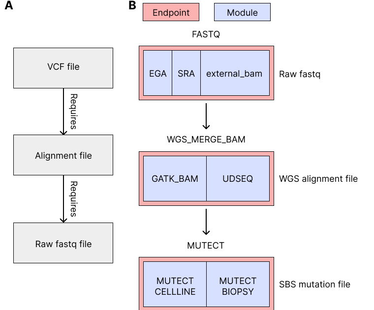
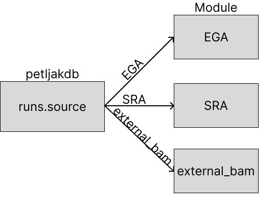
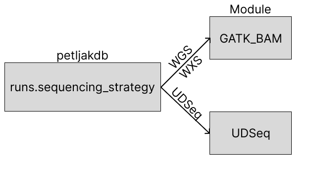
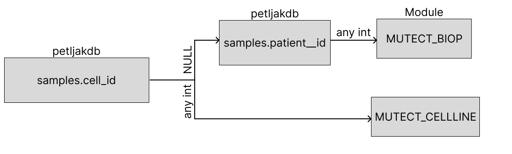
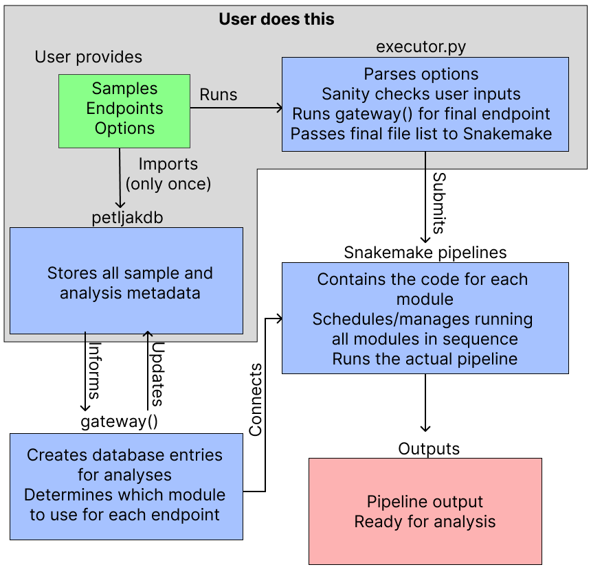
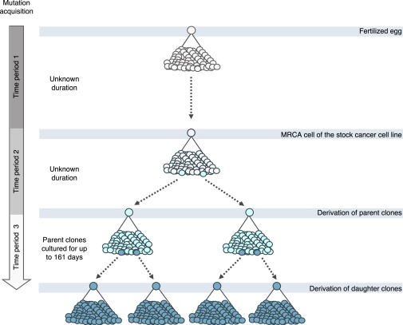

# petljaklab bioinformatics pipelines

Bioinformatics workflows for the [Petljak Lab](https://petljaklab.com/) at the Perlmutter Cancer Center, written by [Luka Culibrk](https://github.com/lculibrk)

To compile this document from markdown use the following command:

```
singularity run -B /gpfs/ /gpfs/data/petljaklab/containers/pandoc/latex_2.6.sif \
   README.md \
   -o pipelines.pdf \
   --variable colorlinks=true \
   -H disable_float.tex
```

## Quick Execute

```python ./executor.py [--idfile ID_FILE | --id SAMPLE_ID] --pipeline ENDPOINT [snakemake options]```

- idfile must be a text file containing one sample or run ID per row
- id is a single sample or run ID
- pipeline is the desired endpoint, such as `FASTQ`. See below for a comprehensive list
- snakemake options are passed to the workflow manager, [Snakemake. (click me for more information)](https://snakemake.readthedocs.io/en/stable/)

## Overview and key definitions

The petljaklab pipelines are a collection of modules to simplify the process of performing genomics-related tasks such as variant calling or WGS alignment. Figure 1 illustrates conceptually how the pipelines work. 

Two key definitions to keep in mind:

- **endpoints** describe the final product of a pipeline. For example the endpoint `WGS_MERGE_BAM` is a mapped WGS alignment file for a biological sample. An endpoint is considered satisfied when their output is generated, e.g. `WGS_MERGE_BAM` is satisfied for a sample when its `.cram` is generated. 
- **workflows** or equivalently **modules** are methods for satisfying an endpoint. 



Figure 1A illustrates how endpoints become satisfied. To satisfy the requirement for a variant file, first an alignment file is needed, which in turn needs a raw fastq. Each of these steps represents an endpoint. 

Multiple methods can produce the same type of file, as illustrated in Figure 1B. For example, fastq can be provided by either the Sequence Read Archive (SRA), the European Genome-Phenome Archive (EGA), or extracted from existing alignment files (external_bam). In any case, the resulting file is still a fastq. Any fastq produced can then be used for mapping into an alignment file - either through a UDseq-specific pipeline or a generic pipeline using the Genome Analysis ToolKit (GATK). The same applies to variant calling - separate pipelines exist for variant calling in cell line or biopsy sequencing contexts, but they both produce variant call files. 

The pipelines are written in a way to enable a user to specify the end product that they want to make - ie. a variant call file, without needing to explicitly outline the specific methods of how each step is done. 

## Execution

The executor function, `executor.py` is given a sample (or list of samples) alongside an endpoint. The logic of which pipelines are used to satisfy the endpoints are automatically determined. 
Refer to the database/API repo for information on how the data are stored there.

Once a module is executed, a matching entry in the database is created in the `analyses` table, which tracks pertinent information such as the directory where the analysis results can be found, as well as the time the analysis was run. 

## List of current endpoints:

- FASTQ generation (`FASTQ`)
- Alignment (`WGS_MERGE_BAM`)
- SNV calling with Mutect2 (`MUTECT`)
- Indel calling with Mutect2, Strelka2, and Varscan2 (`INDEL`)
- Somatic (combines all variant calling endpoints) (`SOMATIC`)

Each endpoint has at least one module that can generate that endpoint. 

## List of current modules:

FASTQ:

- SRA-hosted data (`SRA`)
- EGA-hosted data (`EGA`)
- Local BAM files to be remapped (`EXTERNAL_BAM`)

Alignment:

- GATK WGS best practices CRAM (`GATK_BAM`)
- Single molecule sequencing and variant calling (`UDSEQ`)

SNV calling:

- Parent-daughter cell line (`MUTECT_CELLLINE`)

Indel calling:

- Tumor-normal (`INDEL`)

The `SOMATIC` endpoint forces both SNV and Indel endpoints to be executed.

## Module documentation

Before running an analysis, the metadata must be loaded into the `petljakdb`. One biological sample corresponds to one entry in the `samples` table. Each sample can have one or many runs, each of which must be entered into the `runs` table. Refer to the `petljakdb` documentation for the definition of the columns for each table. The below sections discuss each endpoint, as well as the information that must be present in the `petljakdb` in order to run the pipelines for that endpoint. 

### FASTQ endpoint



The above figure describes the decision tree for deciding which module to use for the FASTQ endpoint. Critical table/column: `runs`, column `source`. Accepted values are `EGA`, `SRA`, `external_bam`, or `local`, accordingly. `local` is not discussed because there is no code that needs to be run for it. 

This endpoint generates a FASTQ file to be used as input for downstream analyses/modules. Below is a description of the modules that satisfy the FASTQ endpoint and their particular instructions. 

#### 1. EGA

The data are stored on the EGA. The data are pulled from the EGA using the pyEGA program. 

In addition to the `source` column as mentioned above, the EGA ID must be present in the `biosample_id` column of the `samples` table. 

#### 2. SRA

The data are stored on the SRA. The data are pulled from the SRA using the SRA toolkit. 

In addition to the `source` column as mentioned above, the SRA ID must be present in the `biosample_id` column of the `samples` table. 

#### 3. EXTERNAL_BAM

The data are found locally as BAM/CRAM files. The bam files are converted back to unmapped fastq using `samtools`.

The `source` column must be set to `external_bam`, and there must be an appropriate amendment to `modules/EXTERNAL_BAM/PREP_EXTERNAL_BAM.smk` as described below and in the file itself. This is a temporary workaround. 

#### 4. local fastq

Local fastq is the simplest, as we do not need to run any code to generate it. The `fastq_path` column in the `runs` table must point to the **fastq prefix**. 

Why the prefix/what is the prefix? 

fastq files come in pairs. Provide the name up until R1/R2, for example if there is a pair of R1/R2 fastq files:

`/gpfs/data/sequence/results/petljaklab/2024-09-03/fastq/PC9_A4-26_S18_L001_R1_001.fastq.gz`

`/gpfs/data/sequence/results/petljaklab/2024-09-03/fastq/PC9_A4-26_S18_L001_R2_001.fastq.gz`

The prefix would be everything before the R#, so:

`/gpfs/data/sequence/results/petljaklab/2024-09-03/fastq/PC9_A4-26_S18_L001_R`

This string is what must be stored in the `fastq_path` column. 

### WGS_MERGE_BAM endpoint



The above figure describes the decision tree for deciding which module to use for the WGS_MERGE_BAM endpoint. The critical table/column is the `samples` table and `strategy` column. If `strategy` is `WGS` or `WXS`, the `GATK_BAM` module is used. If `strategy` is UDSEQ, the `UDSEQ` module is used. Two modules exist to handle this endpoint - `GATK_BAM` and `UDSEQ`. 

This endpoint generates a DNA-seq CRAM file to be used as input for downstream analyses/modules. Below is a description of the modules that satisfy the WGS_MERGE_BAM endpoint and their particular instructions. 

#### 1. GATK_BAM

The bam is generated according to GATK best practices. Adapters are marked using GATK MarkAdapters, the reads are mapped using bwa-mem, duplicates are marked using GATK MarkDuplicatesSpark and the resulting alignment files are merged and converted to CRAM v3.1 format. 

As mentioned above, the `strategy` column for the sample must be set to either `WGS` (whole genome sequencing) or `WXS` (whole exome sequencing). 

#### 2. UDSEQ

The bam is generated using the UDSeq pipeline. Reads are trimmed of barcodes using DupCallerTrim, mapped using bwa-mem, duplicates marked in a single-molecule aware manner using GATK MarkDuplicates and variants are called using DupCaller.

As mentioned above, the `strategy` column for the sample must be set to `UDSEQ`. 

### SNV endpoint



The above figure describes the decision tree for deciding which module to use for the MUTECT endpoint. The critical table/column is the `sample` table and `cell_id` and `patient_id` columns - one of the two must be set. If `cell_id` is set, the `MUTECT_CELLLINE` module is used. Otherwise if `patient_id` is set, the `MUTECT_BIOP` module is used. This module requires the `WGS_MERGE_BAM` endpoint to be satisfied, or satisfiable. 

#### 1. MUTECT_CELLLINE


Each daughter cell must have the `sample_parent_id` column of the `sample` table set to the numeric ID of the parental sample. Parental samples should not have this column set (ie. `NULL`)

This is a multi-step variant calling workflow that involves the following steps:

1. Daughter CRAMs are variant called by Mutect2
2. Daughter CRAMs are variant called by Mutect2, with extreme sensitivity
3. For each cell **lineage** (ie. for all cells arising from the same parent), combine the variants in 2.
4. Parent CRAMs are variant called by Mutect2, and all variants identified in 3. are genotyped.  
5. Mutations from 1. are flagged for each daughter, in this order (ie. a mutation satisfying condition i is labeled accordingly and further checks are not made):
	
   i.   If the mutation has <15x coverage in parent, it is filtered and labeled accordingly
	
   ii.  If the mutation is present in >50% of all parents from that cell line, it is filtered and labeled accordingly.
	
   iii. If the mutation is present in any daughter derived from a different parent, it is filtered and labeled accordingly.
	
   iv.  If the mutation is present in other related daughters, it is **not** filtered, but labeled
	
   v.   Mutations private to the daughter are **not** filtered and labeled as unique. 

#### 2. MUTECT_BIOP

This is a standard Mutect2 variant calling workflow of tumor using matched normal. The `normal_sample` of the `patient` table must be set to the sample ID of the matched normal. 

### INDEL endpoint

The database setup is identical as in the `SNV` endpoint. Currently indel calling is only supported for cell line samples.

#### 1. INDEL

Indel calling and filtering is performed identically as in the MUTECT_CELLLINE module. 

### SOMATIC endpoint

This is a convenience endpoint that combines both `SNV` and `INDEL` endpoints together - by specifying `SOMATIC`, both `SNV` and `INDEL` will be satisfied. 

## Module-specific instructions

Some modules cannot run automatically in a pipeline because intermediate steps need to finish executing and be loaded into the database before future steps can be properly planned by the pipelines. The main example is the `EXTERNAL_BAM` module, which satisfies the `FASTQ` endpoint if alignment files exist locally. This is because the logic to determine how many runs exist in an alignment file is not fully integrated into the pipelines yet. Consequently the below section is a temporary workaround.  

### EXTERNAL_BAM

 In order to process a preprocessed bam/cram into fastq for realignment/reprocessing to be consistent with the rest of our data, we need to first get run information out of the bams/crams. To do this, there's a module that runs separately from the rest of the pipeline, PREP_EXTERNAL_BAM. Currently it is configured to only work on studyID 3. Before you can run any of the other pipelines from an external bam set, first you need to run PREP_EXTERNAL_BAM on the files to load the runs data into the database. Once it completes, you may then execute other modules, e.g. `SOMATIC`.

There is a function `get_external_bam_path` that accomplishes a mapping from a sample ID to the path to the bams, which is the bit that's specific to study 3. It is found in `modules/EXTERNAL_BAM/PREP_EXTERNAL_BAM.smk`. 

Once it's adapted to your dataset, simply execute the pipeline on your samples as instructed above with  `--pipeline LOAD_EXTERNAL_BAM` and the pipeline should take care of loading. Then, the required runs data will be in the database for the pipeline to know, for e.g., how many run-specific bams to extract from each sample-specific bam. 

## Developer documentation (how to add modules/endpoints to the pipelines)

This section is somewhat more technical and is intended for people relatively proficient in python and snakemake in order to understand and contribute to the pipelines. 

### How the pipelines work



These pipelines are intended to be as simple to execute as possible. `gateway()`,  a convenience function, exists to enable the quick accession of the endpoint of an analysis for a given entity (study/sample/run). For example, a call to `gateway()` for the FASTQ endpoint determines the appropriate source for the FASTQ files based on their entries in the `petljakdb`. Similarly, a `gateway()` call for the `MUTECT` endpoint should determine whether the samples are cell lines or patients, and thereby determine which module to use to satisfy the `MUTECT` endpoint.

Overall, the `petljakdb` should store all the metadata required to handle how the pipelines are run. The pipeline framework should, therefore, utilize this information to reproducibly and consistently execute analyses on data entities in a generalizable fashion. 

### To add a new pipeline:
1. Create a new Snakefile module under `modules/`
2. Modify `modules/db_deps.py` to include this new pipeline:
   
   a) modify the `db_deps` dictionary. It expects a key:list pair, where the list elements are the DB tables needed for this analysis. For most analyses downstream of CRAM, this should be studies and samples.

   b) add the pipeline to the `module_outputs` dictionary. This maps the name of the pipeline to the type of analysis. For example, we would run a different Mutect pipeline for biopsies vs cell lines, so this dict tracks that both analyses would create a `MUTECT` endpoint. Similarly, we have multiple ways to make a FASTQ, depending on the data source, and this is documented accordingly in `module_outputs`.
   
   c) Modify `module_inputs`. This maps each module with the **endpoint** that is required for input. For example, the mapping module needs FASTQ. It doesn't particularly care where the FASTQ came from, just that it gets made.

3. Add it to `gateway()` in `lib/input_functions.py`. If it's a new endpoint, you'll need to add code to handle that endpoint. Otherwise, if it's a new module for an existing endpoint, you need to add the appropriate code to handle this module and decide when it should be executed (as opposed to another module to satisfy the endpoint). 


## Step by step instructions

Here you will find step-by-step instruction-by-example on loading data into the database and how to execute the SOMATIC pipeline. 

### 1. Load metadata

This step is study-specific depending on how your metadata are structured. The easiest way to do this is to write a script that iterates over each sample/run and inserts a corresponding entry to the `petljakdb`. You can use the `petljakapi` [(click me)](https://github.com/petljaklab/petljakapi) for a programming interface to the database. Below is an example set of samples/runs and a generously commented python script that would add this to the `petljakdb`. Alternative functional solutions are welcome according to personal preference. 

This experiment had two parental HeLa lines, hela A and hela B, with two different genotypes, A, and B. Each parent had two daughters, and the samples were each sequenced on two lanes. 

| sample_name | lane | line | KO | path                      |
|-------------|------|------|----|---------------------------|
| hela_A      | 1    | hela | A  | example/data/hela_A1_R    |
| hela_A      | 2    | hela | A  | example/data/hela_A2_R    |
| hela_A_1    | 1    | hela | A  | example/data/hela_A_1_1_R |
| hela_A_1    | 2    | hela | A  | example/data/hela_A_1_2_R |
| hela_A_2    | 1    | hela | A  | example/data/hela_A_2_1_R |
| hela_A_2    | 2    | hela | A  | example/data/hela_A_2_2_R |
| hela_B      | 1    | hela | B  | example/data/hela_B1_R    |
| hela_B      | 2    | hela | B  | example/data/hela_B2_R    |
| hela_B_1    | 1    | hela | B  | example/data/hela_B_1_1_R |
| hela_B_1    | 2    | hela | B  | example/data/hela_B_1_2_R |
| hela_B_2    | 1    | hela | B  | example/data/hela_B_2_1_R |
| hela_B_2    | 2    | hela | B  | example/data/hela_B_2_2_R |

```
## Import API
import petljakapi

## Set variables

## Read and parse the metadata table above
with open("table.txt") as f:
   tab = f.readlines()
tab = [l.strip().split("\t") for l in tab]

## insert the study, get the ID
## first layer of index is the rows of the return, 
## second index is the column (col 0 is always ID) 
study_id = petljakapi.insert.genetic_insert({"rname":"test_name"}, 
                                             "studies", db)[0][0]

## Loop over the rows
for line in tab:
   ## Add the cell line and get the cell line ID
   cell_id = petljakapi.insert.generic_insert({"rname":line[2]}, "cells", db)[0][0]
   ## Determine if daughter
   if line[0].endswith("1") or line[0].endswith("2"):
      ## get parent name
      parent_name = line[0][:-2]
      ## Query for the parent
      parent_id = petljakapi.select.generic_select({"rname":parent_name}, 
                                                    "samples", db)[0][0]
   else:
      parent_id = None

   ## Insert the sample into the DB
   ## making sure to add rname, cell_id, sample_parent_id, study_id, and treatment
   samp_id = petljakapi.insert.generic_insert(
      {"rname":line[0], 
       "cell_id":cell_id, 
       "sample_parent_id":parent_id, 
       "study_id":study_id, 
       "treatment":line[3]}, "samples", db)
   ## insert the run
   run_id = petljakapi.insert.generic_insert(
      {"rname":line[0] + "_L" str(line[1]), 
       "cell_id":cell_id, 
       "sample_id":samp_id,
       "study_id":study_id,
       "source":"local",
       "sequencing_strategy":"WGS",
       "fastq_path":line[4]}, "runs", db)
```

### 2. Dumping the IDs from the database

Once this is done, you can dump the sample IDs to a text file (ie. in bash):

```
mysql petljakdb -B --execute 'SELECT * from SAMPLES WHERE study_id=my_study_id' |
 awk '{print "MPS00"$0}' > my_ids.txt
```

### 3. Executing the pipeline

Finally, simply execute the pipeline on the IDs in my_ids.txt, specifying the SOMATIC endpoint:

```
python executor.py --idfile my_ids.txt --pipeline SOMATIC
```

\newpage

## Supplementary information

Below is a description of the logic behind some pipelines, intended to justify/clarify why some decisions were made.

### Cell line study basics



In these experiments, we isolate single-cell derived colonies of a cell line to use as a parent. The colony is allowed to grow for a certain length of time, and/or is treated according to the experimental treatment condition if exogenous processes are being investigated. After the prescribed length of time, single-cell clones are derived and grown for a short period of time to allow enough DNA be present for sequencing. 

In a parent-daughter subcloning experiment, as intended to be processed by these pipelines, a number of different categories of mutations are found. During life, somatic mutations accumulate as part of aging, endogenous and exogenous processes, including cancer. After a cell line is derived from an individual, the line continues to accumulate somatic mutations in culture. Finally, during an in vitro experiment that we wish to analyze, more somatic mutations accumulate. We are only interested in the final category, and therefore all other mutations need to be identified as comprehensively as possible.

Adding to the difficulties, parental cell lines are not a comprehensive catalog of everything we wish to subtract from a daughter. Subclonal mutations occur at frequencies below typical detection rates for whole-genome sequencing at 30-40x coverage. If the parental colony was propagated for a long time, individual clones within the culture may be subject to considerable genetic drift which would be identified as false de novo mutations in single-cell derived daughters. 

We can leverage information from related samples to help identify pre-existing mutations. Firstly, we simple remove mutations that were not sequenced deeply in the parental as the depth of coverage is not sufficient to rule out pre-existing mutations. Next, 0other parents of the same cell line can be used to identify pre-existing mutations that may not have been identified in the direct parent of a given daughter. Finally, mutations present in other daughters derived from a different parent can also identify pre-existing mutations in a similar fashion. Below is an example of mutations grouped into these categories, and also mutations shared within daughters derived from the same parent, and mutations private to each daughter - both of these categories are mutations that we deem true de novo mutations and are retained. 


We use the same filtering criteria for indel mutations. 