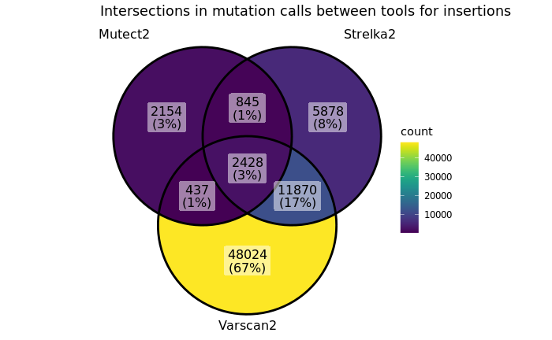
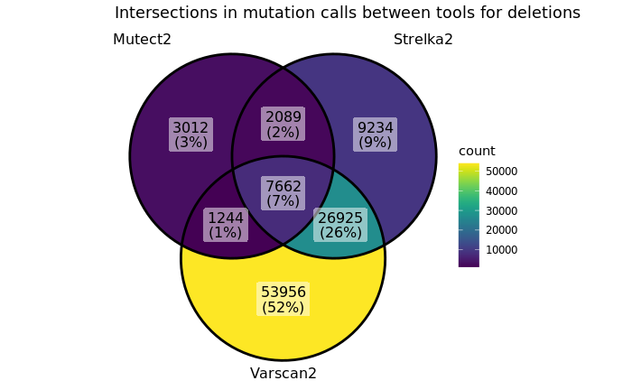

# Petljak lab indel cell line pipeline
## Author: Luka Culibrk
## January 2025

### Introduction

Indel calling is much harder than SBS calling. Errors in sequencing, along with sequence homology result in miscalling of indel variants much more often than other variant types. Here I do my best to describe issues encountered and our best efforts in mitigating them while trying to call indels in WGS cell lines.

First, consensus calling is discussed. 

### Consensus calling

We applied Mutect2, Varscan2, and Strelka2 to calling indels in a cohort of whole-genome sequenced cancer cell lines. These lines essentially exhibited only a few operative mutational processes - aging, APOBEC3, and oxidative stress (ie SBS18). We first assessed the concordance of calling mutations with the three callers.

