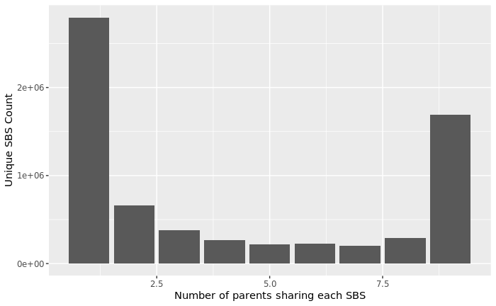
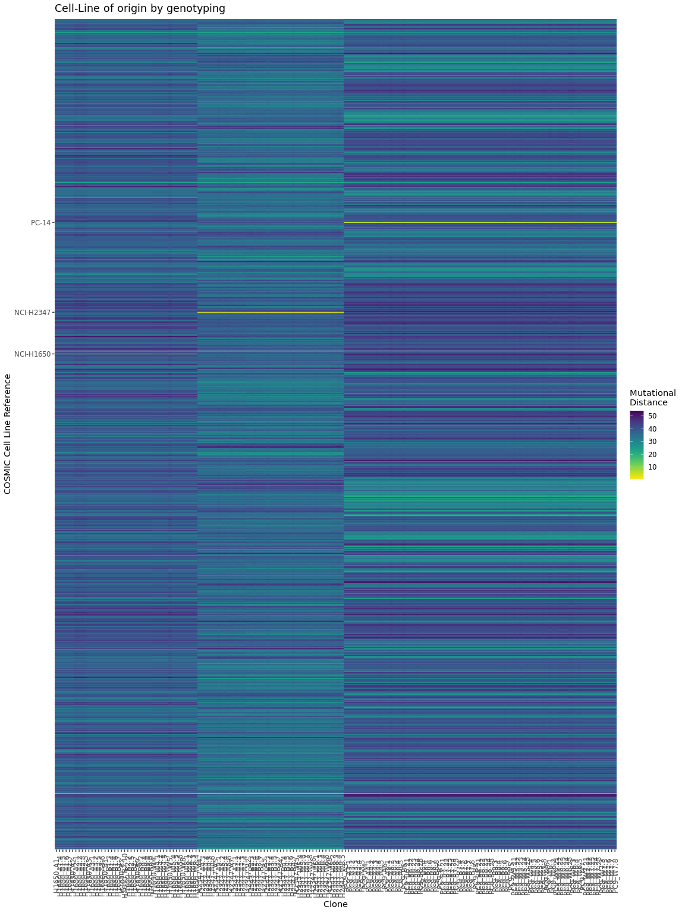

# Petljak lab mutect-cell line pipeline

For calling SBS from cell lines, we use Mutect2 with some adaptations for the data: We quantify shared mutations between clonally-derived daughters and each other, with parental cells, and with daughters derived from unrelated parents. This enables identification of mutations that may have not been sequenced in the parent by random chance, or variants arising from systematic errors. 

## SBS calling procedure (figures below for justifications on certain points):

1. We variant call daughters, using parent as the "matched normal", and default settings in Mutect2.
2. We do the same as in step 1, but we pass `--genotype-germline-sites` to ensure that all variants are emitted (ie. so obviously germline variants are not output). This is important, because we need to force calling of all non-reference sites in the parent.
3. The VCFs from 1. and 2. are processed as reccommended by the GATK team, all the way to FilterMutectCalls
4. For each lineage (e.g. clonal cell of origin), we merge the variant calls from step 2 into a new VCF
5. We variant call parents, without a matched normal, using the VCF from step 4 to ensure that all potential variants are called and emitted.
6. daughter variants from step 1 are filtered:
    
    a. All variants where the parental coverage was <15x are discarded (not enough evidence to conclude whether the variant is de novo)
    
    b. All variants that were identified in >50% of parents. This means that the variant is likely pre-existing, but we did not sequence it by random chance in the parent. 

    c. Variants present in non-related daughters. Based on close analysis of alignment data, these are largely either gemline variants or mapping artifacts. 

    d. Variants that are shared between related daughters are flagged but not filtered. These indicate, for e.g., potential clonal expansions. 
7. The resulting variant calls are output, re-headered, and validated using GATK's ValidateVariants

## Figures and justifications for ambiguous decisions:

### 50% threshold for parental sharedness captures the vast majority of pre-existing mutations

In a cohort consisting of 71 daughters derived from 18 parents from 2 lines (35-9 and 36-9), the count of parents that shared individual mutations was quantified. The plurality of mutations are found within only one parent, and a large secondary population of mutations are found within all parents. Smaller numbers of mutations are found within 2-8 parents.  Selecting any number in this range is likely to work here overall. We selected 50% as that's a convenient middle ground that is likely to extend well to larger/smaller numbers of parents.

## QC

We perform two levels of QC using variant data. First, we check to ensure that we've sequenced the cell line we think we've sequenced, using COSMIC's set of discriminatory SNPs for 1k cell lines. Secondly, we check for intersects between high clonality, private parental mutations and daughters to verify/check for sample swaps.

### Cell line of origin

In this experiment, we used NCI-H1650, NCI-H2347, and PC-9(PC-14) cells. Mutational distance was computed based on the allelic distance - e.g. if an H1650 reference SNP is A/B and we sequence A/A, the distance is 0.5. If the reference is A/A and we sequence B/B, the distance is 1.0. We compute the total distance for all 93 SNPs and we can clearly see that the cell lines match with their presumed cell line of origin.

### Parent of origin

Each parental line has its own private set of mutations that should be distinct from other parental lineages. We harness this genetic fingerprint to determine which parent gave rise to which daughter. 

