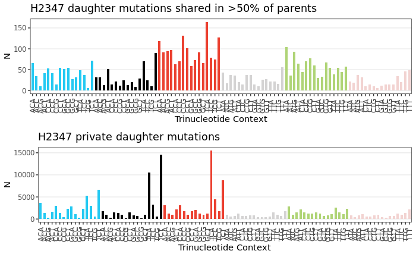
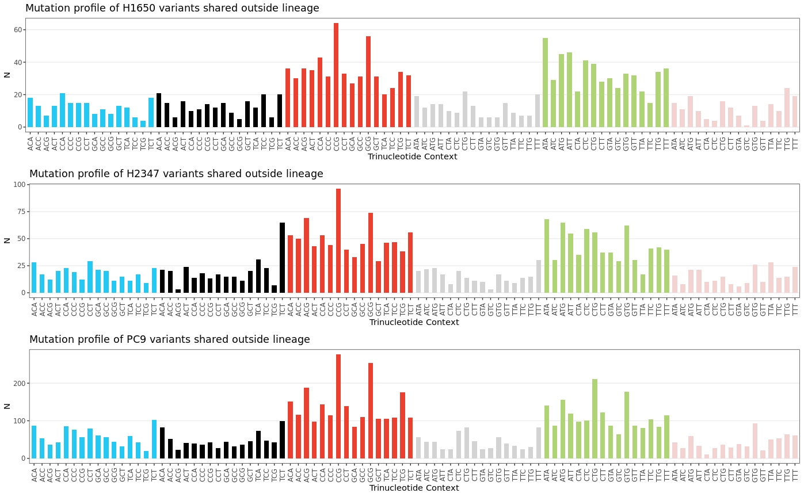
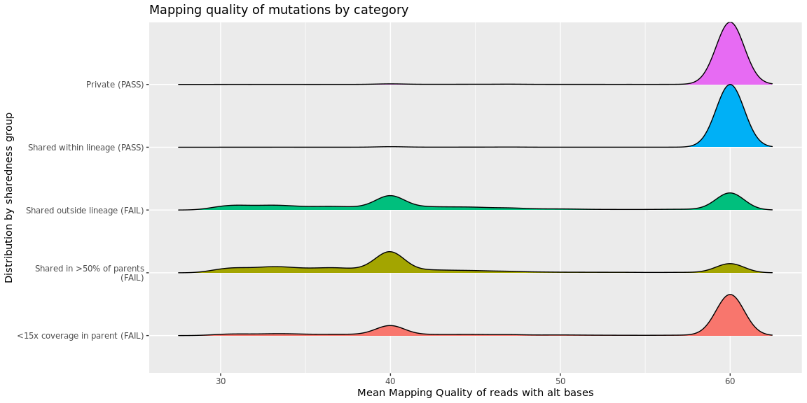
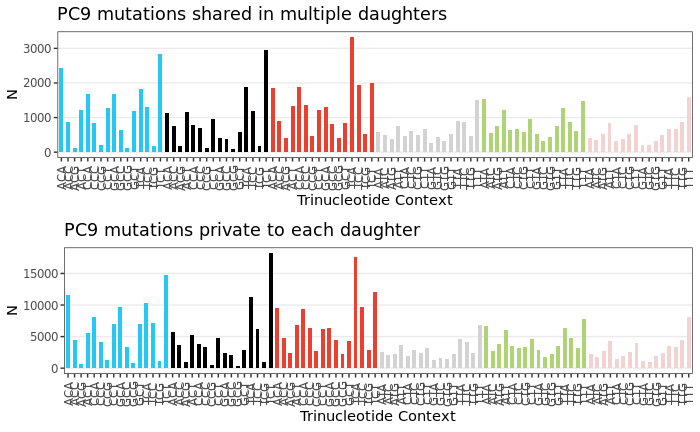
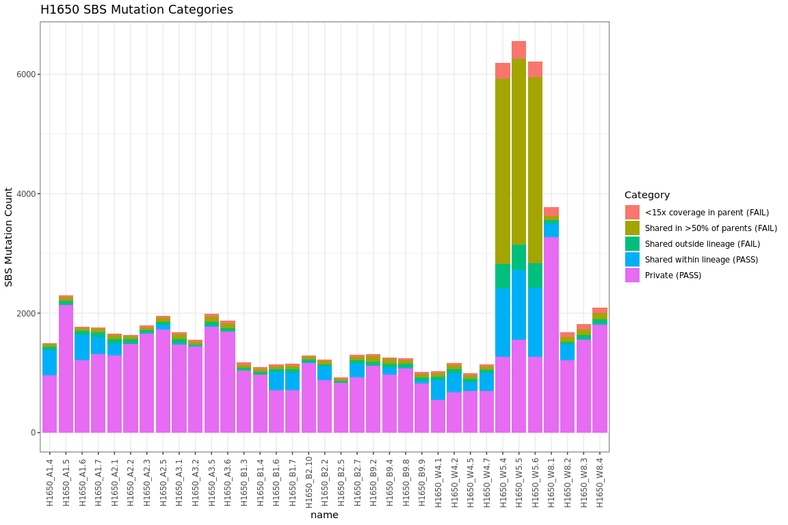
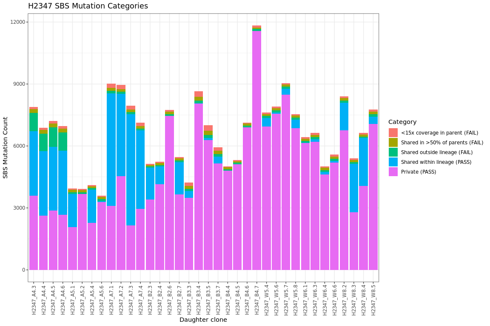
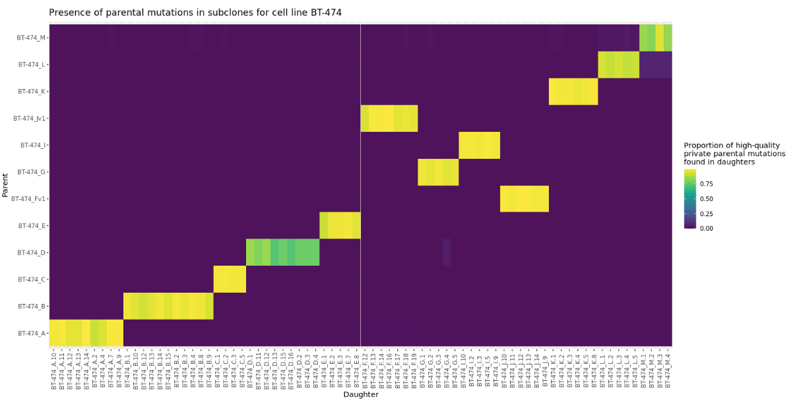

# Petljak lab mutect-cell line pipeline

For calling SBS from cell lines, we use Mutect2 with some adaptations for the data: We quantify shared mutations between clonally-derived daughters and each other, with parental cells, and with daughters derived from unrelated parents. This enables identification of mutations that may have not been sequenced in the parent by random chance, or variants arising from systematic errors. 

## SBS calling procedure (figures below for justifications on certain points):

1. We variant call daughters, using parent as the "matched normal", and default settings in Mutect2.
2. We do the same as in step 1, but we pass `--genotype-germline-sites` to ensure that all variants are emitted (ie. so obviously germline variants are not output). This is important, because we need to force calling of all non-reference sites in the parent.
3. The VCFs from 1. and 2. are processed as reccommended by the GATK team, all the way to FilterMutectCalls
4. For each lineage (e.g. clonal cell of origin), we merge the variant calls from step 2 into a new VCF
5. We variant call parents, without a matched normal, using the VCF from step 4 to ensure that all potential variants are called and emitted.
6. daughter variants from step 1 are filtered:
    
    a. All variants where the parental coverage was <15x are discarded (not enough evidence to conclude whether the variant is de novo)
    
    b. All variants that were identified in >50% of parents. This means that the variant is likely pre-existing, but we did not sequence it by random chance in the parent. 

    c. Variants present in non-related daughters. Based on close analysis of alignment data, these are largely either gemline variants or mapping artifacts. 

    d. Variants that are shared between related daughters are flagged but not filtered. These indicate, for e.g., potential clonal expansions. 
7. The resulting variant calls are output, re-headered, and validated using GATK's ValidateVariants

## Figures and justifications for ambiguous decisions:

### 50% threshold for parental sharedness captures the vast majority of pre-existing mutations

In a cohort consisting of 71 daughters derived from 18 parents from 2 lines (35-9 and 36-9), the count of parents that shared individual mutations was quantified. The plurality of mutations are found within only one parent, and a large secondary population of mutations are found within all parents. Smaller numbers of mutations are found within 2-8 parents.  Selecting any number in this range is likely to work here overall. We selected 50% as that's a convenient middle ground that is likely to extend well to larger/smaller numbers of parents.

### Variants shared between >50% of parents are enriched for junk

Using H2347 cells as an example (they have SBS2/13 mutational signatures active), we plot the 96-context mutational profiles of variants that are shared in >50% of parents and variants that private to each daughter. The mutational profile of variants that are found in >50% of parents is far flatter, and shows high SBS5 character - indicating that they are enriched for pre-existing mutations in the line. We filter these mutations out.

### Variants shared outside the lineage are generally low quality

Mutations that are shared with other daughters outside the lineage are similarly junk. Similar to mutations shared within parents, the variants are enriched for SBS5-like character, indicating likely pre-existing mutations. Furthermore, the variants are enriched for mapping artifacts; their MAPQs are systematically lower than other categories of mutations:

Finally, if one checks these mutations on IGV, it can be seen that these variants are often found in e.g. LINE elements with high sequence similarity to other regions of the genome. Consequently they cannot be trusted and we filter these out.

### Variants shared between related daughters, but not outside their lineage, are probably okay.

Mutations shared amongst multiple daughters are either pre-existing at a fraction too low to reliably sequence, or arose from early clonal expansion in the daughter lineages. Statistically, at 30-40x coverage, it is far more likely that these are de novo mutations acquired early in culture compared to failing to sequence by random chance. Because the mutational profiles look pretty similar to private mutations, and because of the overall statistical likelihood of them being de novo, we keep these mutations.

### Overall mutation classification

We plot the overall mutation classes based on the above filtering steps.

The mutation class plots above reveal some interesting things.

Firstly, it should be noted that we determined the H1650_W5 daughters are sample swaps, as well as H2347_A4 and H2347_A7. For the H1650_W5, we can see that because the variant calling was performed against a _very_ wrong parent, many mutations get caught in the >50% parents filter. For the H2347 sample swapped clones, however, we find that this doesn't happen - instead we get a ton of mutations shared between daughters of the same lineage. One hypothesis for why this is, is that the erroneous parent for the H2347 clones is still fairly closely related to the daughters, resulting in still largely successful filtering of pre-existing variants. 

Aside from this, we see that the number of mutations filtered by our extra filters is fairly low for most samples. Based on the mutational profiles (above), we can be fairly confident that we've removed pre-existing junk to get overall cleaner mutation call sets for these samples. 

## QC

We perform two levels of QC using variant data. First, we check to ensure that we've sequenced the cell line we think we've sequenced, using COSMIC's set of discriminatory SNPs for 1k cell lines. Secondly, we check for intersects between high clonality, private parental mutations and daughters to verify/check for sample swaps.

### Cell line of origin

In this experiment, we used NCI-H1650, NCI-H2347, and PC-9(PC-14) cells. Mutational distance was computed based on the allelic distance - e.g. if an H1650 reference SNP is A/B and we sequence A/A, the distance is 0.5. If the reference is A/A and we sequence B/B, the distance is 1.0. We compute the total distance for all 93 SNPs and we can clearly see that the cell lines match with their presumed cell line of origin.

### Parent of origin

Each parental line has its own private set of mutations that should be distinct from other parental lineages. We harness this genetic fingerprint to determine which parent gave rise to which daughter. We select variants in the parent with a VAF > 0.25 that have not been found in and other parent. We are fairly strict with this, omitting any variant that has any sequence evidence in any other parent - even one read. We then check to see if these variants are represented in the daughters. In the above figure, the Y-axis represents the parental samples, and the X-axis represents each daughter sample. The tiles are colored by overlap. It can be seen that, for example, BT-474_A daughters match with BT-474_A parent, which is good and expected. However, the BT-474_F daughters match with BT-474_Jv1 parents, which consistutes a sample swap. These swaps are easily visualized using the heatmap above.

